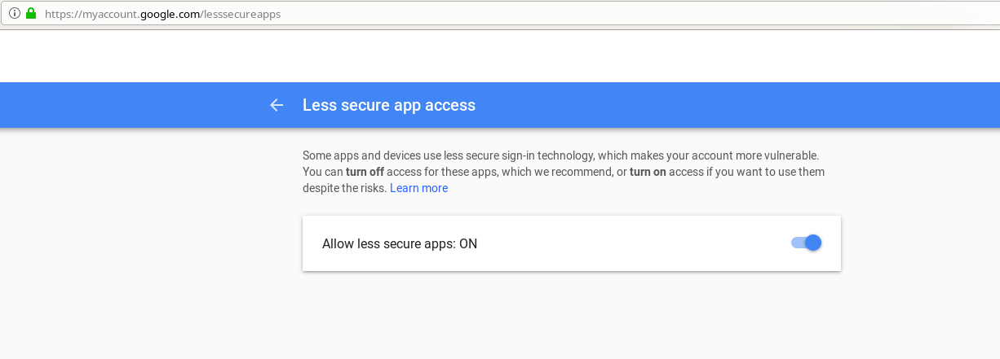
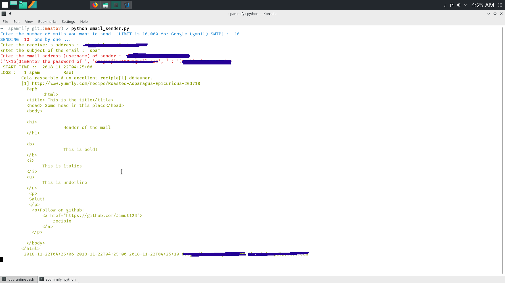
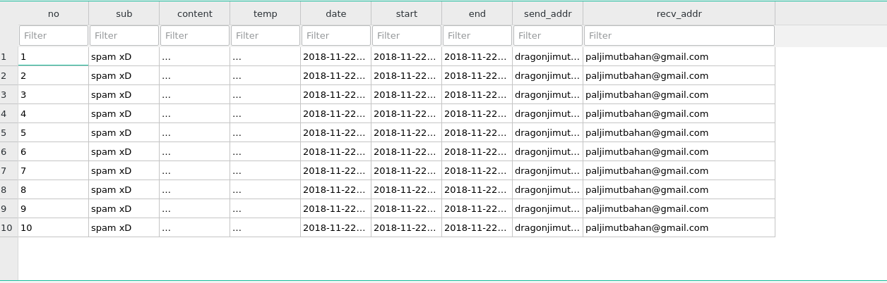
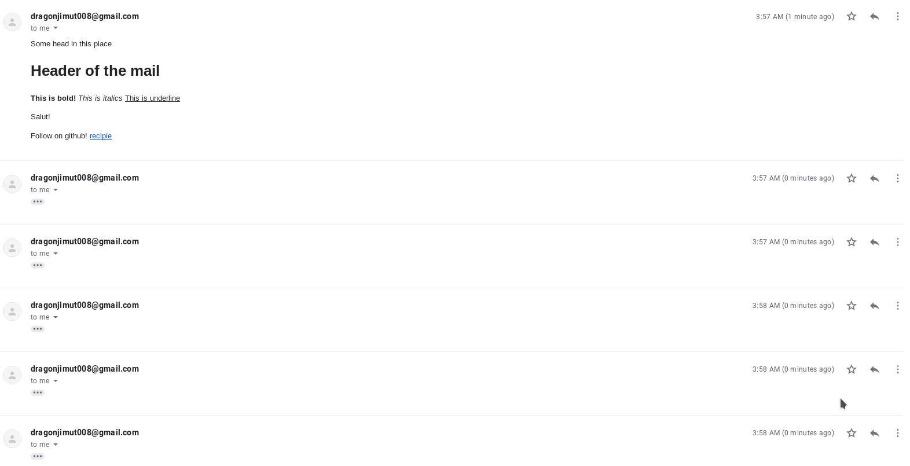

# SPAMMIFY

This is a spam email sender CLI. Please note, I'm not responsible for the consequences of this software. Use at your own risk.
Don't spam until you need to.


# Requirements

* email
* colorama

## Do this first 
```
sudo su
pip install email
pip install colorama

```

# Some general overview 

#### Turn the [less secured application](https://myaccount.google.com/lesssecureapps) option ON in your gmail.





#### The program in execution



#### The database



#### The sent email



# Author 
* [Jimut Bahan Pal](https://www.linkedin.com/in/jimut-bahan-pal-156862123/?originalSubdomain=in)